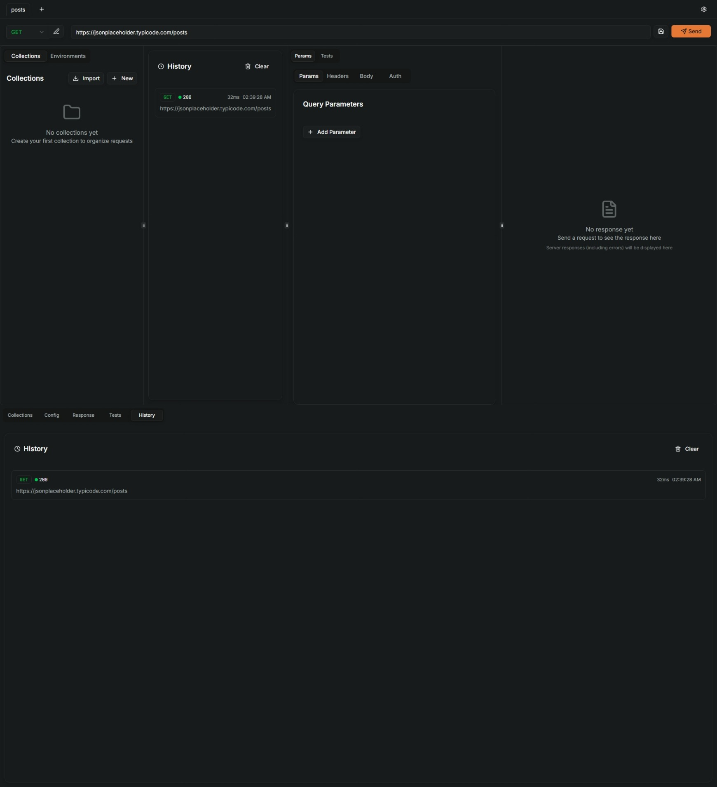

# Reqly - Professional API Testing Tool

<div align="center">
  

  
  **A comprehensive, professional-grade API testing platform built with modern web technologies**
  
  [](https://tauri.app/)
  [](https://preactjs.com/)
  [](https://www.typescriptlang.org/)
  [](https://opensource.org/licenses/MIT)
</div>


## Official page
[reqly-page.vercel.app](https://reqly-page.vercel.app)

## 🚀 Features

### Core API Testing
- **HTTP Methods**: Support for GET, POST, PUT, DELETE, PATCH, HEAD, OPTIONS, and **custom methods**
- **Request Builder**: Advanced interface for headers, query parameters, and authentication
- **Body Editor**: Beautiful JSON editor with syntax highlighting and formatting
- **Response Viewer**: Smart viewer with Pretty/Raw modes for JSON, HTML, XML, and images
- **Real-time Metrics**: Status codes, response times, and payload sizes

### Organization & Management
- **Collections**: Organize requests into logical groups and folders
- **Saved Requests**: Build a library of reusable API calls
- **Environment Variables**: Manage different configurations (dev, staging, prod)
- **Variable Substitution**: Dynamic values using `{{variable}}` syntax
- **Import/Export**: Share collections and environments with your team

### Advanced Testing
- **Test Scripts**: Write JavaScript tests using Postman-compatible `pm` API
- **Pre-request Scripts**: Execute code before sending requests
- **Test Results**: Detailed pass/fail reports with timing and assertions
- **Environment Integration**: Access and modify variables during test execution
- **Automated Validation**: Assert response status, headers, and body content

### Developer Experience
- **Tabbed Interface**: Manage multiple requests simultaneously
- **Request History**: Track and replay previous API calls
- **Dark Mode**: Easy on the eyes for long coding sessions
- **Keyboard Shortcuts**: Power-user friendly (⌘/Ctrl+Enter to Send)
- **Mobile-Optimized**: Clean, responsive interface that works everywhere
- **Proxy Support**: Optional secure forwarding with custom headers

## 🛠️ Installation

### Prerequisites
- [Node.js](https://nodejs.org/) (v16 or higher)
- [Rust](https://rustup.rs/) (latest stable)
- [pnpm](https://pnpm.io/) or npm

### Development Setup

```bash
# Clone the repository
git clone https://github.com/VMASPAD/reqly.git
cd reqly

# Install dependencies
npm install

# Start development server
npm run dev

# Build for production
npm run build

# Create Tauri app bundle
npm run tauri build
```

## 🎯 Quick Start

### Basic Request
1. Select HTTP method (or enter custom method)
2. Enter your API endpoint URL
3. Add headers and parameters as needed
4. Click **Send** or press `Ctrl/Cmd + Enter`

### Using Collections
1. Click **Collections** in the sidebar
2. Create a new collection with the **+** button
3. Add folders to organize related requests
4. Save requests to your collection for reuse

### Environment Variables
1. Go to **Collections** > **Environments**
2. Create a new environment (e.g., "Development", "Production")
3. Add variables like `{{baseUrl}}`, `{{apiKey}}`
4. Use variables in your requests: `{{baseUrl}}/api/users`

### Writing Tests
1. Open the **Tests** tab in your request
2. Write JavaScript test scripts using the `pm` object:

```javascript
pm.test("Status code is 200", function () {
    pm.response.to.have.status(200);
});

pm.test("Response has user data", function () {
    const responseJson = pm.response.json();
    pm.expect(responseJson).to.have.property("id");
    pm.expect(responseJson.name).to.be.a("string");
});
```

3. Click **Run Tests** to execute validation

### Pre-request Scripts
```javascript
// Set dynamic timestamp
pm.globals.set("timestamp", Date.now());

// Set authentication header
const token = pm.environment.get("authToken");
if (token) {
    pm.request.headers.add({
        key: "Authorization",
        value: "Bearer " + token
    });
}
```

## 🔧 Configuration

### Proxy Settings
- Configure optional proxy for CORS bypass
- Add custom headers for proxy requests
- Toggle proxy on/off per request

### Keyboard Shortcuts
- `Ctrl/Cmd + Enter`: Send request
- `Ctrl/Cmd + S`: Save current request
- `Ctrl/Cmd + N`: New tab
- `Ctrl/Cmd + W`: Close current tab

## 🏗️ Architecture

### Tech Stack
- **Frontend**: Preact + TypeScript + Vite
- **Desktop**: Tauri (Rust)
- **Styling**: Tailwind CSS + shadcn/ui components
- **Code Editor**: CodeMirror 6
- **State Management**: Custom hooks with localStorage persistence
- **HTTP Client**: Fetch API with proxy support

### Project Structure
```
src/
├── components/          # UI components
│   ├── ui/             # Base UI components (buttons, inputs, etc.)
│   ├── Fetch.tsx       # Main request interface
│   ├── Collections.tsx # Collections management
│   ├── Testing.tsx     # Test scripts and results
│   └── ...
├── lib/                # Core utilities
│   ├── hooks.ts        # State management
│   ├── types.ts        # TypeScript definitions
│   ├── test-engine.ts  # Test execution engine
│   ├── http.ts         # HTTP client
│   └── ...
└── assets/             # Static assets
```

## 🤝 Contributing

We welcome contributions! Please see our [Contributing Guide](CONTRIBUTING.md) for details.

### Development Workflow
1. Fork the repository
2. Create a feature branch: `git checkout -b feature/amazing-feature`
3. Make your changes
4. Run tests: `npm test`
5. Commit changes: `git commit -m 'Add amazing feature'`
6. Push to branch: `git push origin feature/amazing-feature`
7. Open a Pull Request

## 📄 License

This project is licensed under the MIT License - see the [LICENSE](LICENSE) file for details.

## 🙏 Acknowledgments

- [Postman](https://postman.com) for API testing inspiration
- [Tauri](https://tauri.app) for the amazing desktop framework
- [shadcn/ui](https://ui.shadcn.com) for beautiful UI components
- [CodeMirror](https://codemirror.net) for the excellent code editor

## 📞 Support

- **GitHub Issues**: [Report bugs or request features](https://github.com/VMASPAD/reqly/issues)

---

<div align="center">
  <strong>Built with ❤️ by the Reqly team</strong>
</div>
